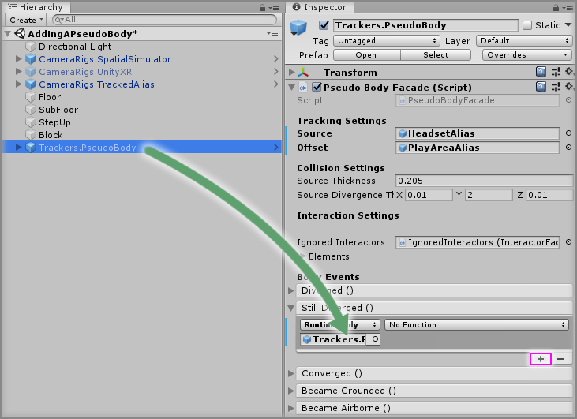

# Adding A Pseudo Body

> * Level: Beginner
>
> * Reading Time: 10 minutes
>
> * Checked with: Unity 2018.3.14f1

## Introduction

The `Trackers.PseudoBody` prefab allows us to provide a virtual presence to the user's real world body position in a spatial scene. We can apply in game physics to our body such walking up steps or falling by using the `Trackers.PseudoBody` prefab as it creates a `RigidBody` that follows our real world head position and translates that into the spatial environment.

## Prerequisites

* [Add the Tilia.CameraRigs.TrackedAlias.Unity -> CameraRigs.TrackedAlias] prefab to the scene hierarchy.
* [Install the Tilia.Trackers.PseudoBody.Unity] package dependency in to your [Unity] project.

## Let's Start

### Step 1

Create a new `Cube` Unity 3D Object by selecting `Main Menu -> GameObject -> 3D Object -> Cube` and change the Transform properties to:

* Position: `X = 0, Y = -0.5, Z = 0`
* Scale: `X = 3, Y = 1, Z = 3`

Rename the new `Cube` to `Floor`.

### Step 2

Create the remaining `Floor` components by duplicating the `Floor` GameObject three times by right clicking on the `Floor` GameObject and selecting `Duplicate` from the context menu.

For each duplicated GameObject change the Transform properties to:

#### Floor (1)

* Position: `X = 0, Y = -5, Z = 3`
* Scale: X = `3, Y = 1, Z = 3`

Rename the duplicated `Floor (1)` to `SubFloor`.

#### Floor (2)

* Position: `X = 0, Y = -4.8, Z = 5`
* Scale: `X = 3, Y = 1, Z = 3`

Rename the duplicated `Floor (2)` to `StepUp`.

#### Floor (3)

* Position: `X = 0, Y = -3, Z = 7`
* Scale: `X = 3, Y = 3, Z = 3`

Rename the duplicated `Floor (3)` to `Block`.

### Step 3

Add a `Trackers.PseudoBody` prefab to the Unity project hierarchy by selecting `GameObject -> Tilia -> Prefabs -> Trackers -> Trackers.PseudoBody` from the Unity main top menu.

### Step 4

We now need to set the `Source` and `Offset` properties of our Pseudo Body prefab. The `Source` determines what GameObject to make the Pseudo Body follow and the `Offset` allows another GameObejct to be used as a positional offset if our `Source` is not centered, such as if the headset is not central to the play area.

Select the `Trackers.PseudoBody` GameObject from the Unity Hierarchy window then drag and drop the `CameraRigs -> Aliases -> HeadsetAlias` GameObject into the `Source` property on the `Pseudo Body Facade` component.

> This will set up our headset as the source of our Pseudo Body position, so when the headset moves in the real world then the Pseudo Body will follow it.

Drag and drop the `CameraRigs -> Aliases -> PlayAreaAlias` GameObject into the `Offset` property on the `Pseudo Body Facade` component.

> This will set up our play area as the offset so this will be used to take into consideration if the user is not standing in the centre of their play area.

### Step 5

Play the Unity scene and walk around the real life play area (or if using the simulator then use the simulator walking keys to move around) and you will see when you walk to the end of the platform, you will fall down to the sub platform. Then when you walk over the step then you will see that you step up.

Notice how you can walk into the block, however the Pseudo Body collider does not follow into the block. This is because the Pseudo Body collider is restricted by game physics, whereas your real body is not limited by game physics.

### Step 6

We can prevent the ability to walk into walls in a number of ways, such as simply fading the headset view if the headset position diverges from the Pseudo Body collider position or we can force the player position to be updated back to where the Pseudo Body collider is located in the safe location.

Let's look at resolving this divergence between the headset and the Pseudo Body collider by setting the user's position back to the safe state that the collider is in.

Select the `Trackers.PseudoBody` GameObject from the Unity Hierarchy window and click the `+` symbol in the bottom right corner of the `Still Diverged` event parameter on the `Pseudo Body Facade` component.

Drag and drop the `Trackers.PseudoBody` GameObject into the event listener box that appears on the `Still Diverged` event parameter on the `Pseudo Body Facade` component that displays `None (Object)`.

Select a function to perform when the `Still Diverged` event is emitted. For this example, select the `PseudoBodyFacade -> SolveBodyCollisions` function.

### Done

Play the Unity scene and you will now notice that when you walk into the block that you can no longer walk into it and the collision is resolved by moving you back to the same position as the Pseudo Body collider.

> Changing the `Source Thickness` property on the `Pseudo Body Facade` component can help if the collision resolution causes a jerky motion.

[Add the Tilia.CameraRigs.TrackedAlias.Unity -> CameraRigs.TrackedAlias]: https://github.com/ExtendRealityLtd/Tilia.CameraRigs.TrackedAlias.Unity/tree/master/Documentation/HowToGuides/AddingATrackedAlias/README.md
[Install the Tilia.Trackers.PseudoBody.Unity]: ../Installation/README.md
[Unity]: https://unity3d.com/